<h1 align="center">🗣️ ChatLingo</h1>

  <b>Full mobile translation & travel companion app</b> 
  <i>Designed & developed end-to-end</i>

  
  
  

---

## Overview
**ChatLingo** is a cross-platform mobile app built to help users communicate across languages in real time and travel together with an integrated social platform.  
I created the app from the ground up — from design and UI/UX to full implementation, authentication, database integration, and deployment.

*Quick psa* There isn't just a random "Hello" on the welcome page, it's animated and displays "Hello" in multiple languages.

## Features
- 🔐 **Authentication system** — sign up, login, password reset  
- 🏠 **Dashboard & social feed** — user progress tracking, social posts, and translation activity  
- 🌍 **Real-time translation** — text and voice input with instant output  
- 👤 **Profiles & settings** — account management, dark mode, notifications  
- ☁️ **Firebase backend** — authentication, Firestore database, storage  

---

<h2 align="center">🔑 Login & Auth</h2>

  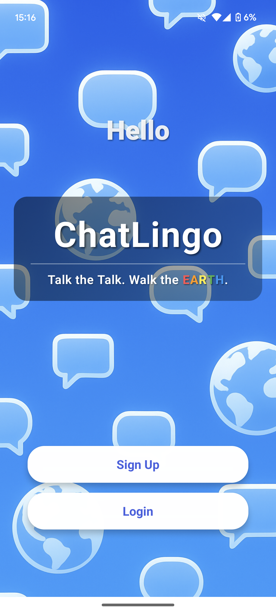
  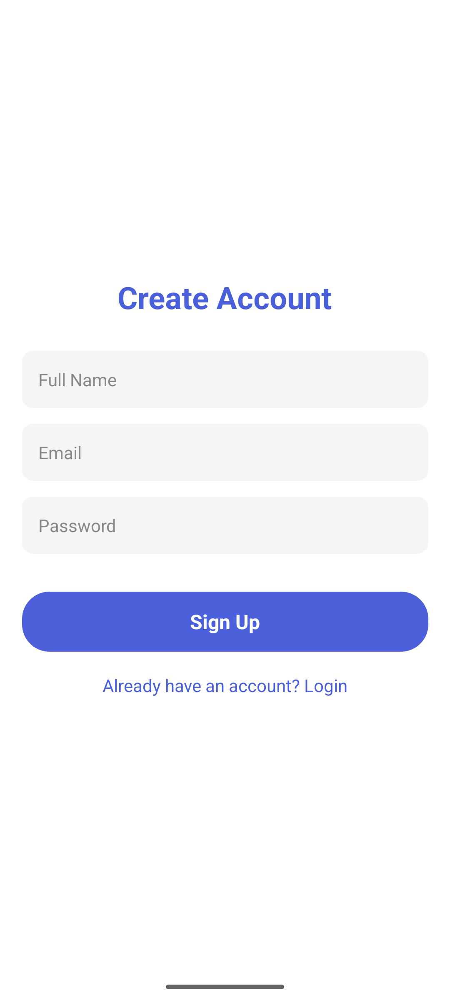
  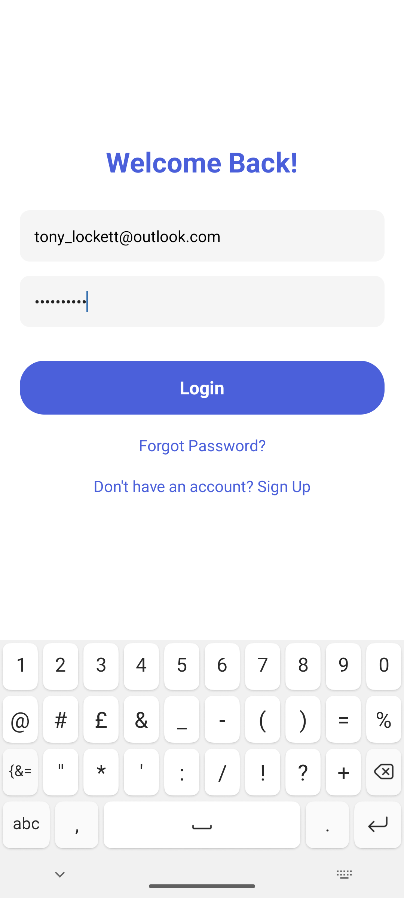

  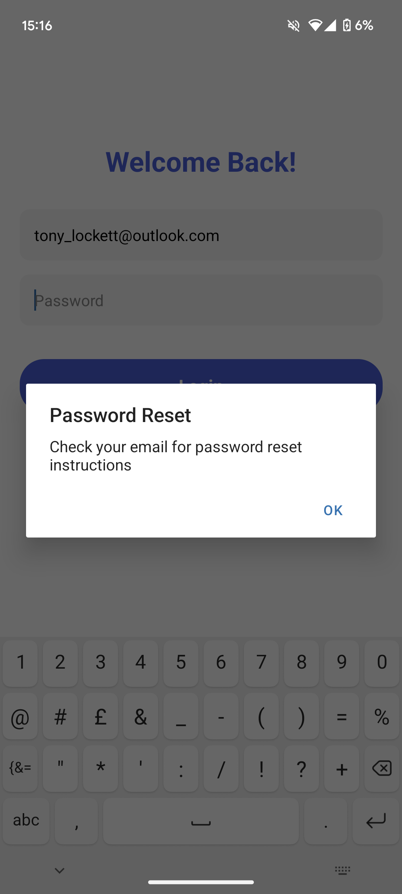
  
  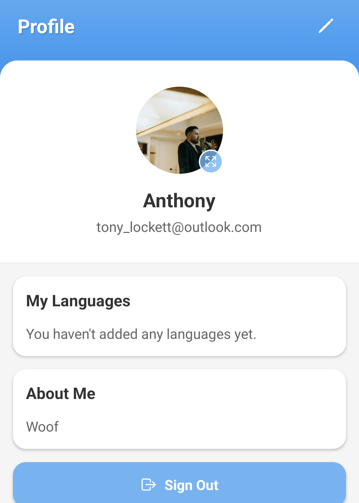

<h2 align="center">🏠 Home & Feed</h2>

  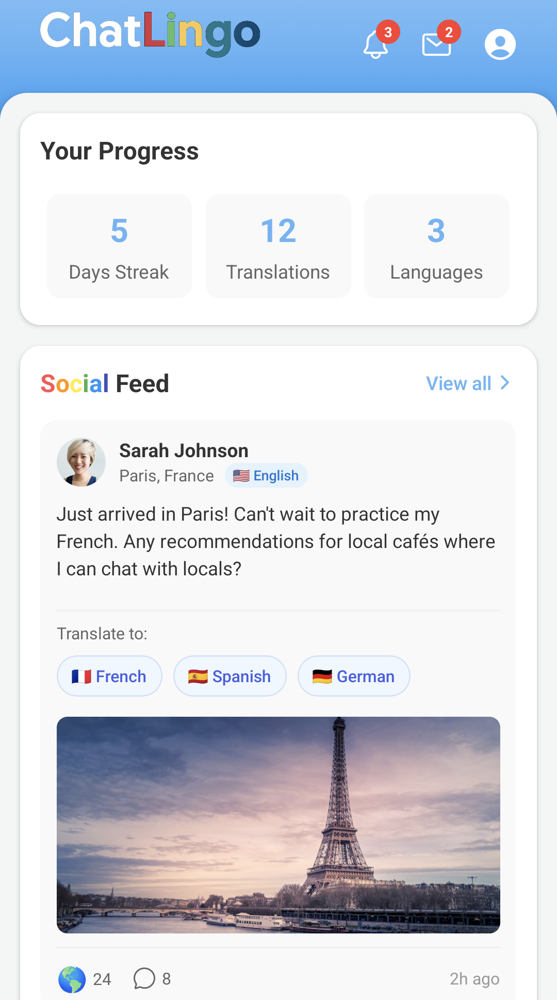
  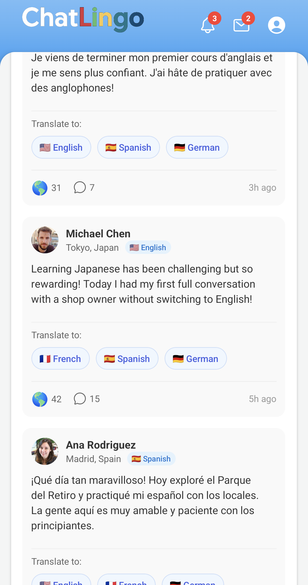
  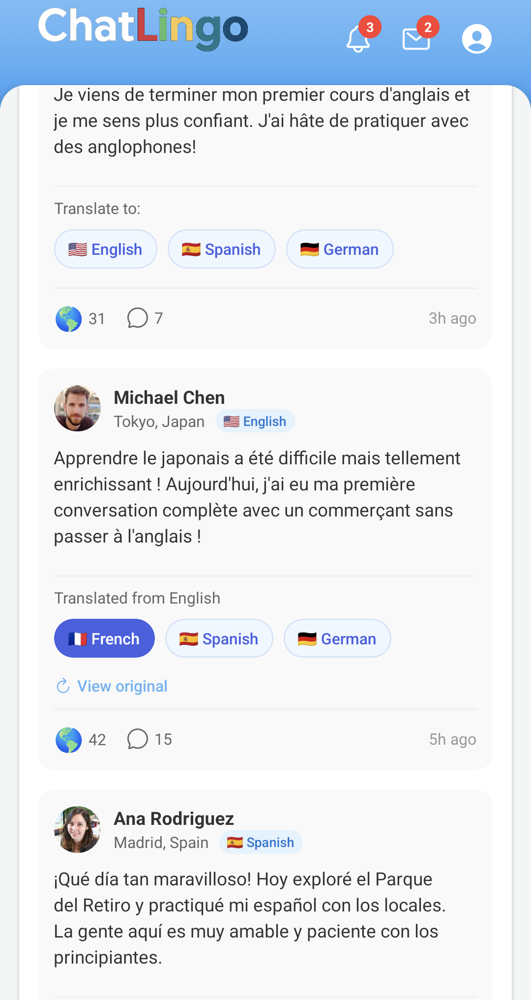

  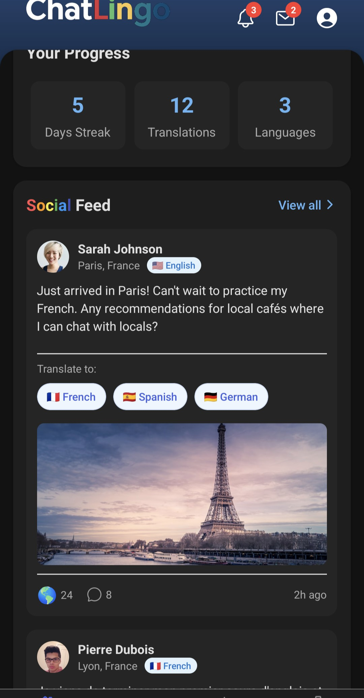

<h2 align="center">🌍 Translation</h2>

  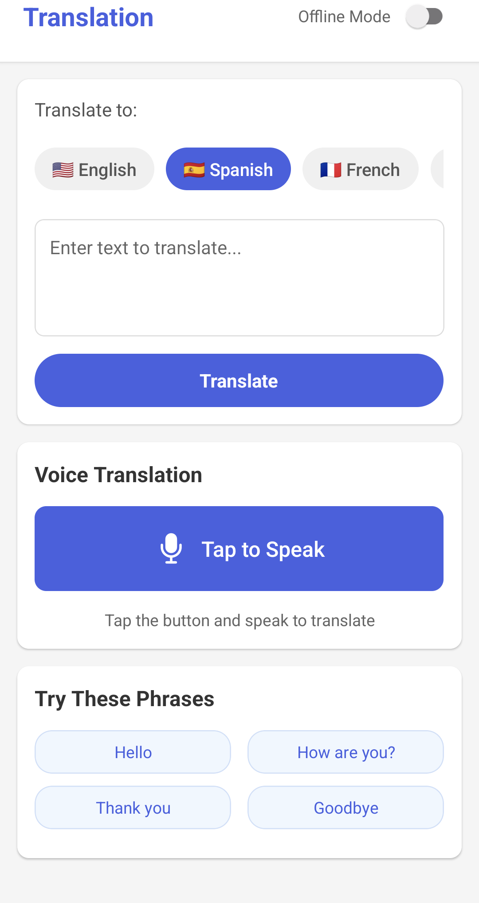

<h2 align="center">⚙️ Settings</h2>

  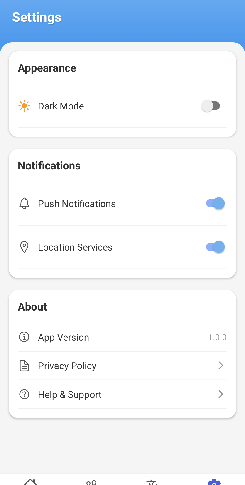
  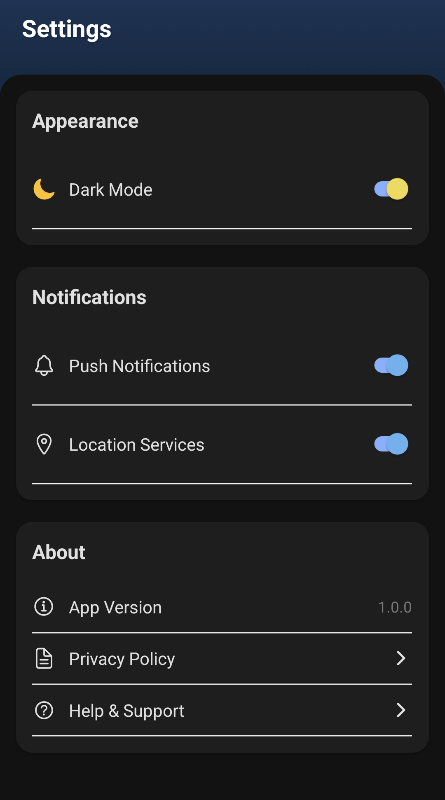

