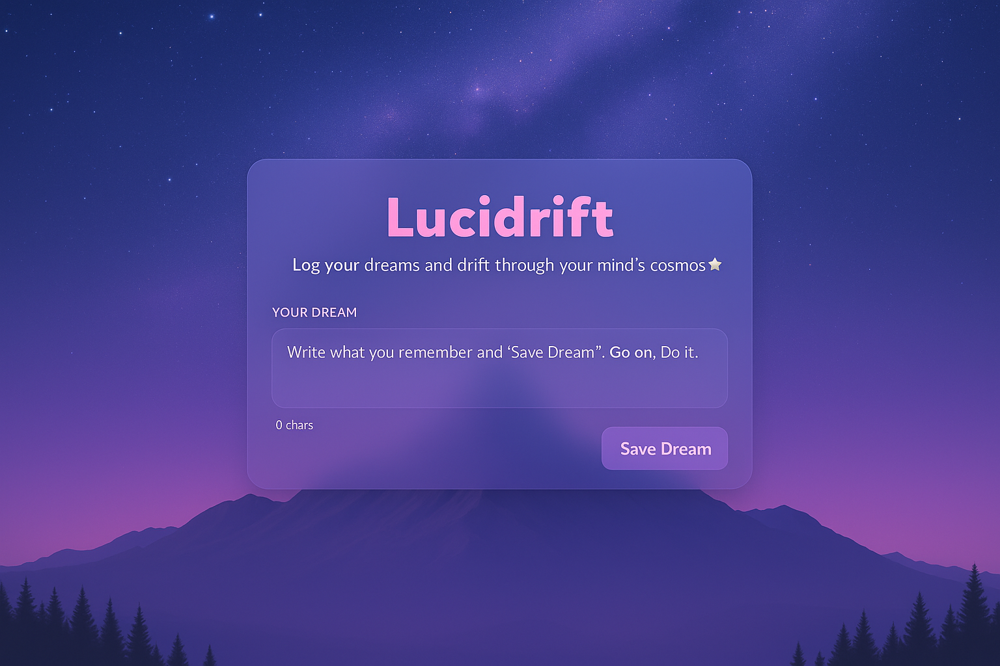
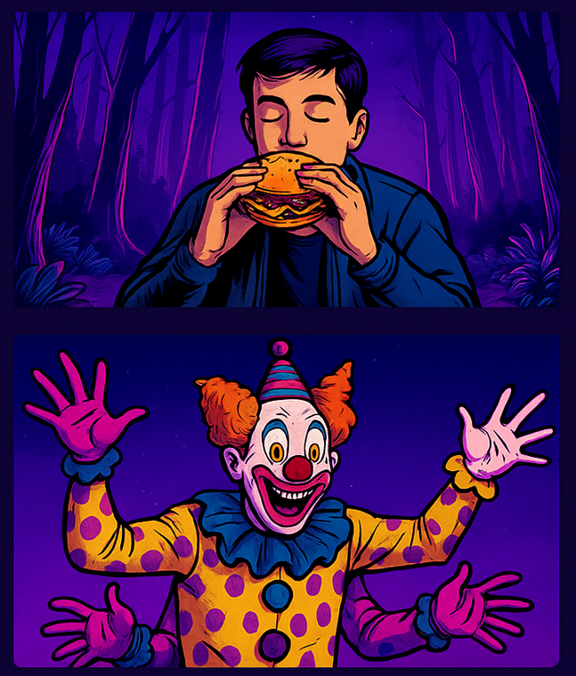

<h1 align="center">💼 Portfolio</h1>

  <b>Front-end focused, full-stack capable</b> 
  <i>React • React Native • Node.js • Firebase • SQL • WordPress</i>

  
  
  
  

---

## 📂 Projects

### 🗣️ [Chatlingo](./Chatlingo/README.md)  
A mobile app for real-time language translation, travel companion and social feed.  
Built with **React Native + Firebase**, featuring authentication, live translation, profiles, and settings.  

  
  

---

### 🌌 [Lucidrift](./Lucidrift/README.md)  
A dream journaling app with **AI-assisted visualisation**.  
Responsive **PWA built with Next.js + Tailwind + Firebase**, featuring dream journaling, immersive UI design, and pipelines for generating comics, reels, and (soon) small dream movies.

  
  

---

### 🌐 Websites  
Custom **WordPress** and **front-end builds** for clients, with capability to extend into full-stack (e.g. SQL-backed dashboards, API integrations).  
Designs typically involve theme customization, client branding, and dynamic features powered by plugins, APIs, or custom PHP logic.

#### 🥡 [Canton City – Live Demo](https://canton-city-demo.vercel.app)  
A modern, responsive website demo for a local Chinese takeaway.  
Built with **Next.js + Tailwind**, featuring:  
- Floating lantern animations for unique branding ✨  
- Sticky mobile “Call / Order” bar for frictionless UX 📱  
- Menu highlights, meal deals, allergen info & Just Eat integration 🍜  

  
  

---

<i>More projects being added soon.</i>

