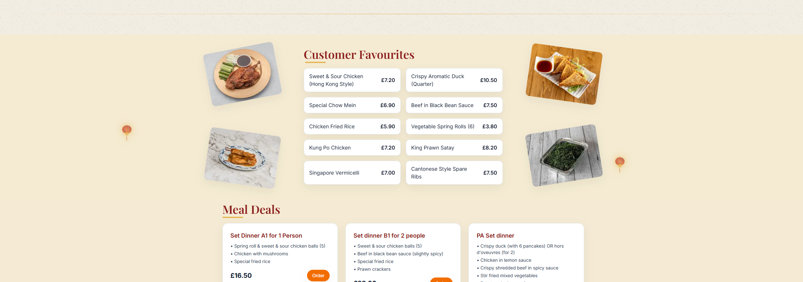

# 🏮 Canton City — Chinese Takeaway Website  

A **modern, responsive website** built for **Canton City**, a family-run Chinese takeaway.  
It highlights their story, popular dishes, and integrates with **Just Eat** for seamless online ordering.  

---

## ✨ Features  
- 📱 **Responsive design** — works beautifully on desktop & mobile.  
- 🏮 **Floating lantern animations** — subtle, branded decorative effect.  
- 📖 **About Us section** — family-run, serving the community for 10+ years.  
- 🥡 **Customer Favourites & Meal Deals** — featured dishes with prices.  
- 🚗 **Just Eat integration** — one-click ordering link.  
- ⚠️ **Allergen & vegan notices** — clear info for customer safety.  

---

## 🖼️ Screenshots  

  

  

  

  

---

## 🔗 Live Demo  
👉 [View Demo on Vercel](https://cantoncity-3rbms17oh-anthonys-projects-840a4d10.vercel.app)  

---

⚡ Built with **Next.js + Tailwind CSS**, deployed on **Vercel**.  
