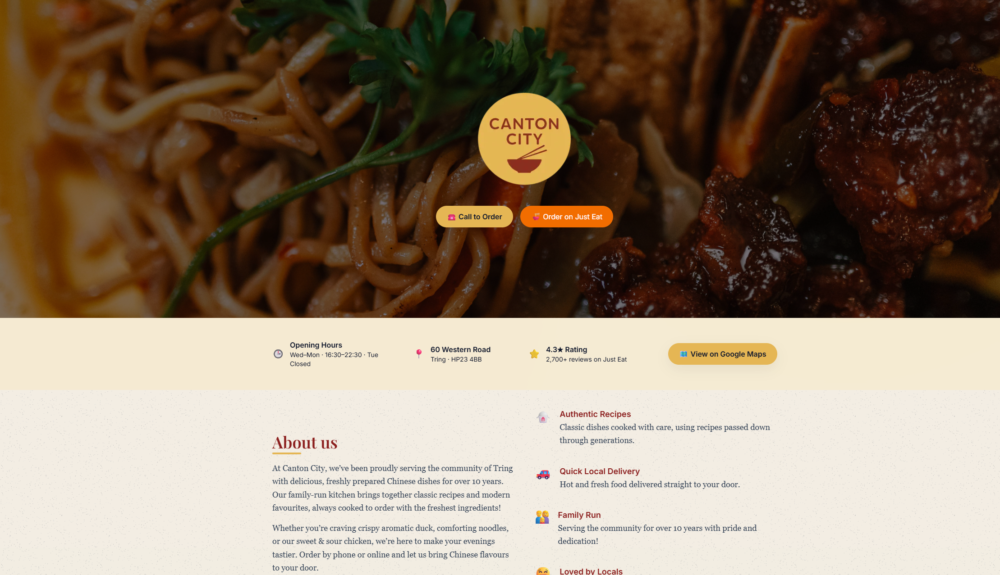

# 🏮 Canton City — Chinese Takeaway Website

A modern, responsive website built for **Canton City**, a family-run Chinese takeaway.  
The site blends a welcoming design with subtle cultural touches, highlights their most popular dishes, and integrates directly with Just Eat for seamless online ordering.

---

## ✨ Key Features

- 📱 **Responsive design** : optimised for both desktop & mobile customers.  
- 🏮 **Floating lantern animations** : subtle branded decoration that adds character without distraction.  
- 📖 **About Us section** : tells the story of a family serving the local community for over 10 years.  
- 🥡 **Customer Favourites & Meal Deals** : featured dishes with prices to encourage quick decisions.  
- 🚗 **Just Eat integration** : one-click ordering with the full menu handled externally.  
- ⚠️ **Allergen & vegan notices** : clear guidance for customer safety and dietary needs.  

---
---

## 🖼️ Screenshots  

  

  

---

## 🔗 Live Demo  
👉 [View Demo on Vercel](https://cantoncity-3rbms17oh-anthonys-projects-840a4d10.vercel.app)  

---

⚡ Built with **Next.js + Tailwind CSS**, deployed on **Vercel**.  
