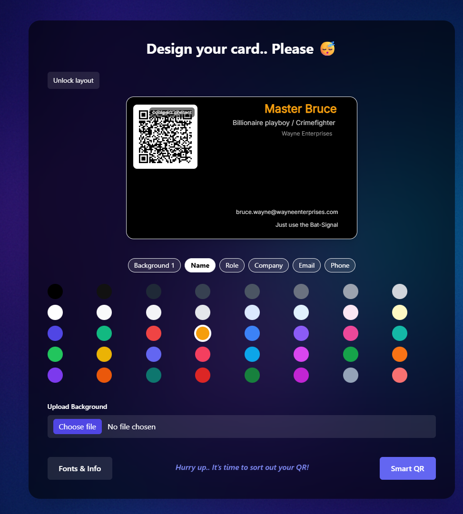
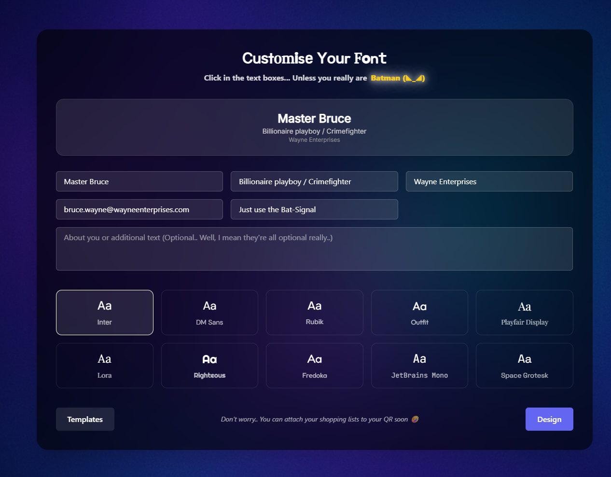
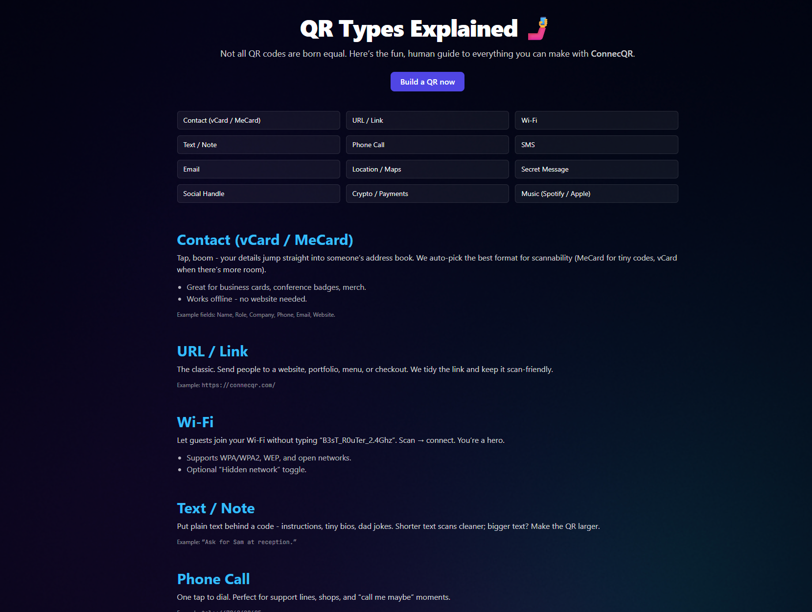

# 📱 ConnecQR  

👉 [Visit ConnecQR](https://connecqr.com)  

ConnecQR is a **modern, production-ready web app** for creating and sharing digital cards with smart QR codes.  
I personally **designed and built everything end-to-end** — from the UI/UX, animations, and branding to the full-stack logic and deployment.  
This isn’t just a demo - it’s a **real, live website** crafted to feel sleek, playful, and professional on any device.  

---

## ✨ Highlights  

- **Smart QR Modes**: vCard contact cards, Wi-Fi logins, website URLs, plain text, Location, Music, & lots more! (to come also).  
- **Full Customisation**: Drag, resize, and style card elements (name, role, company, about, QR) in real time.  
- **Design Freedom**: Choose from unique templates, fonts, and colour palettes - build a card that matches your brand.  
- **Responsive by design**: Built to feel natural on phones, tablets, and desktops — with a smooth step-by-step editor that adapts seamlessly across all devices. 
- **Modern Tech Stack**: Built with **Next.js (App Router) + Tailwind CSS**, ensuring performance, accessibility, and scalability.  
- **Built & Designed by Me**: All visuals, layouts, animations, and logic are hand-coded — no templates or generators.  
- **Hosted Live**: Deployed on a custom domain with SSL, ready for real-world sharing.  

---

### 📸 Screenshots

**Design your card**  

**Fonts & Info**  

**QR Types**  

---

ConnecQR turns a simple QR code into a **personal identity hub** — perfect for freelancers, teams, and anyone who wants to share their details without paper or clutter.  
